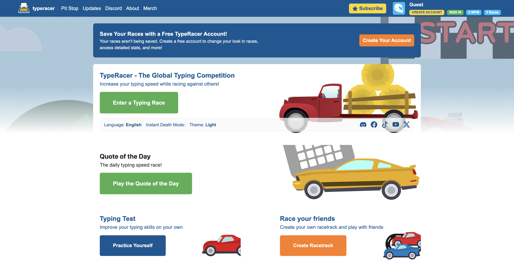

# What's a Framework

In Software Engineering a Framework isn't an actual frame you work with, but rather a set of predefined features to style and add functionality to your html code.

## Bootstrap 5

Bootstrap 5 is an example of a Html framework. It provides classes such as navbar, container, btn, etc.

## Thoughts

Learning bootstrap can be as complicated as complicated as a new programming language, I agree. It can be confusing trying to remember all the different componenets. However, when you do developing becomes a lot easier. For example, when styling a button element instead of changing padding, font, border, alignment, etc in a css file, you can simply add the btn class in html.

### Experience 

I used Bootstrap 5 to recreate the TypeRacer website. I was able to see how helpful it is when I don't have to think about each individual element. 

I think that it's not a choice of frameworks or plain CSS, they have to work together. While frameworks like Bootstrap allow for some customization, it is ultimately general styling. So you need CSS for the finer details and for the Website to look exactly how you want it.
