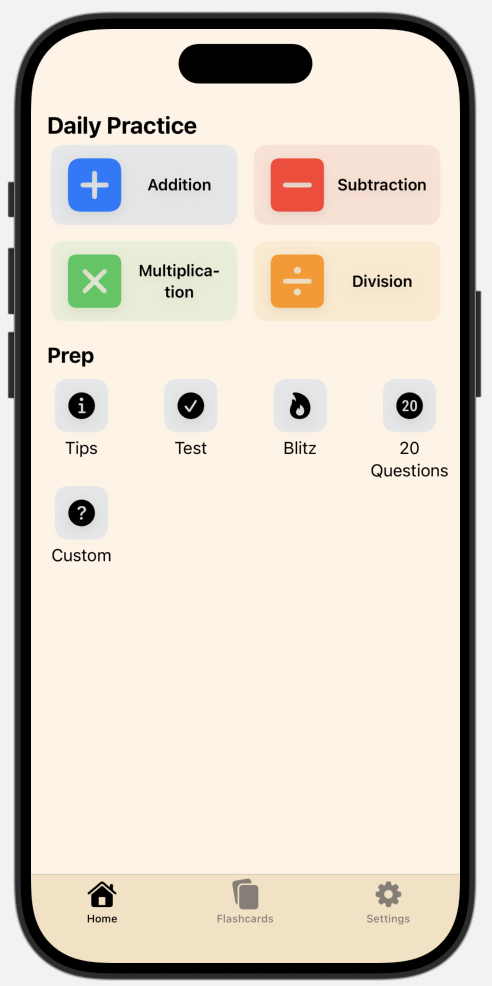
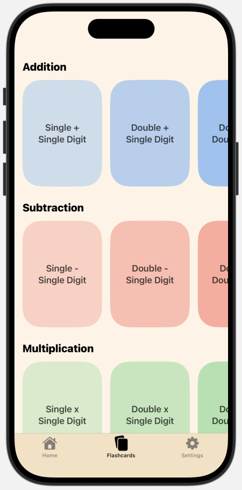

 

## Description
In my senior year of High School I was required to create a project for my STEM Capstone class. I decided to design the basic interface of a mobile app. This mobile app would serve as a way for users to review basic math concepts of addition, subtraction, multiplication, and division. Above is what is the finished result of my project, showcasing the home page and flashcard tool.

# How it works
To create the design for this mobile app, I used XCode, Apple's official IDE for building and testing applications. During the process, I learned how to use Swift and SwiftUI. Swift being the programming language Apple created for designing macOS applications. 

# My role
The creation of this mobile app interface, was done entirely by me with some advice from a mentor. To create the layout of the mobile app, I looked at similar applications and researched the impact visuals have on learning.
