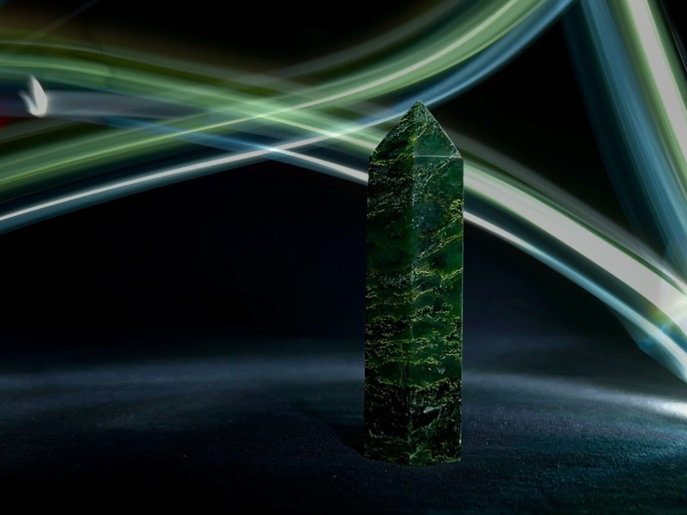

  

# Description
For my senior year of High School, I took photography 2 as an elective. And for one of the projects I was required to research a professional Photographer and take photos recreating their style. I decided on Maria Saggese, a light painting photographer. Light painting photography involves using a slow shutter speed to capture the movement of light.

## My role
This was an individual project, so I was responsible for research, planning, and implementation. To capture light painting photos, I downloaded an app on my iPhone which allowed me to adjust my cameras shutter speed. Repeating the process of taking photos and adjusting, taught me how to learn from mistakes and past attempts.
