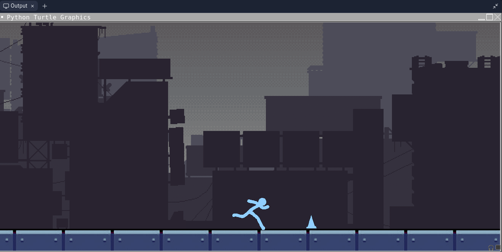

# Description

In my AP Computer Science Principles class our final project was to create anything we wanted using what we had learned. So I decided on a simple game, similar to geometry dash, the user just has to jump over incoming spikes. To do this I used Python and its built in Turtle graphics library. Something I was proud of was creating the stickman running animation, by repeatedly iterating through a list of animation frames.

## My role

As this was an individual project I was responsible for deciding what features were required in the program and implementing them. This included the graphics/design, functionality, and interactivity. For example I had to create the frames for the stickman running animation, then code it so it would look smooth, and finally have it jump when the user interacted with it. 
